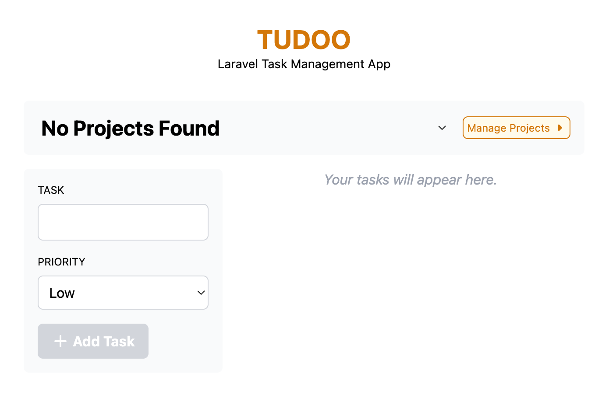
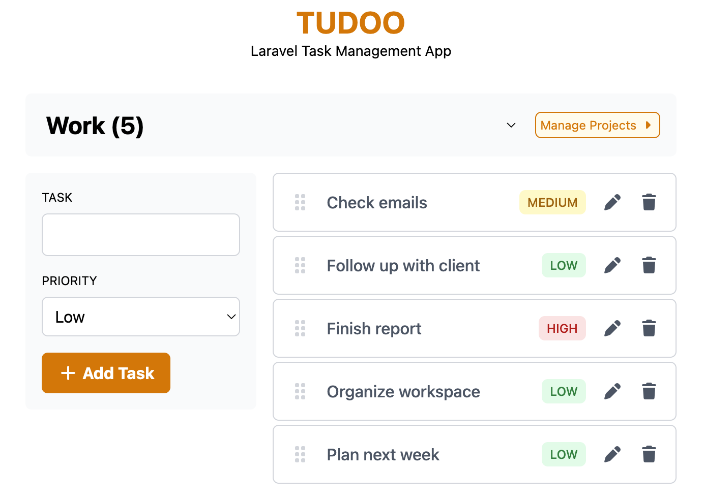
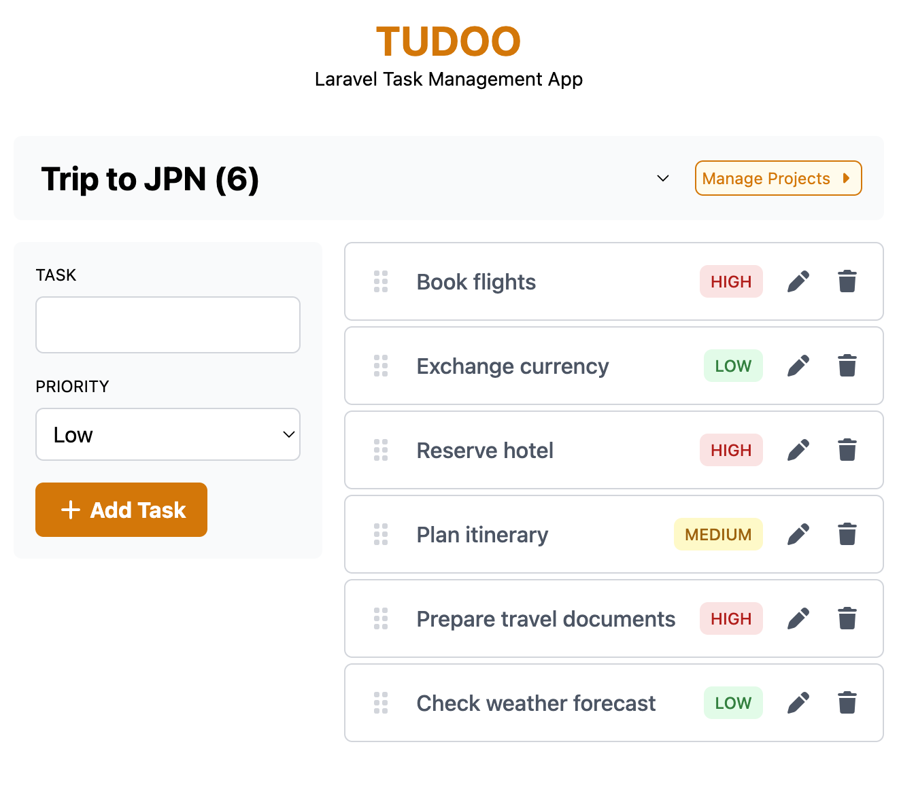
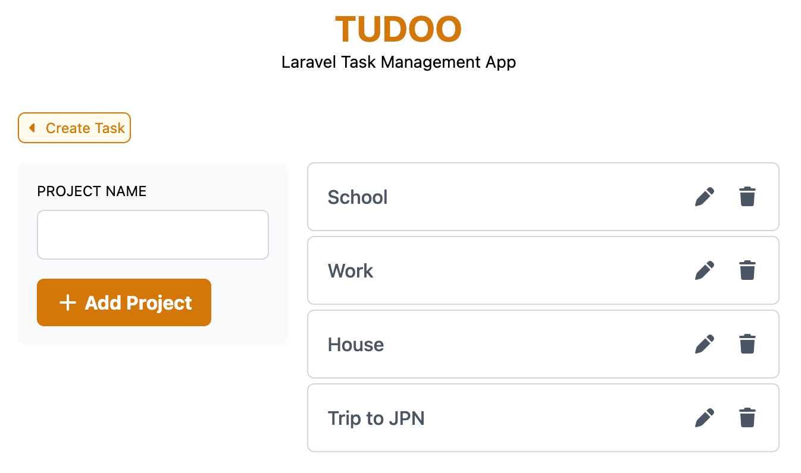

# Tudoo

### Laravel Task Management App

A simple task management application built with Laravel that allows users to organize tasks into projects, manage task priorities, and reorder tasks using drag and drop.

**Tech Stack:** PHP 8.3 · Laravel 13 · MySQL · Tailwind CSS · SortableJS

---

## Features

### 📂 Projects

- Create projects
- Edit project names
- Delete projects and their associated tasks

### ✅ Tasks

- Create tasks under a selected project
- Set task priority: Low, Medium, High
- Edit task names and priorities
- Delete tasks
- Drag and drop tasks to reorder them
- Persist task ordering
- Tasks are displayed based on the selected project

---

## Screenshots

### Tasks





### Projects



---

## Laravel Concepts Demonstrated

- MVC architecture
- Eloquent ORM
- Model relationships
- Database migrations
- Foreign key constraints
- CRUD operations
- Route model handling
- Form validation
- HTTP requests
- Blade templates
- Route groups
- Database persistence
- JavaScript integration with Laravel
- Drag-and-drop functionality
- AJAX/fetch requests
- Tailwind CSS

---

## Key Implementation

### Project-Task Relationship

Tasks belong to projects through Eloquent relationships, with cascading deletion handled by a database foreign key.

### Persistent Task Ordering

SortableJS enables drag-and-drop reordering, with task positions persisted through the `position` field and Laravel's `reorder()` method.

### Project Filtering

Tasks are filtered by the selected project, which also provides the context for creating new tasks.

---

## Requirements

Before running the application, make sure you have:

- PHP 8.3+
- Composer
- Node.js and npm
- MySQL

---

## Installation

1. Clone the repository
```bash
git clone <repo-url>
cd <project-directory>
```

2. Install PHP dependencies
```bash
composer install
```

3. Create the environment file
```bash
cp .env.example .env
```

4. Configure the database in `.env`
```env
DB_CONNECTION=mysql
DB_HOST=127.0.0.1
DB_PORT=3306
DB_DATABASE=tudoo
DB_USERNAME=your_username
DB_PASSWORD=your_password
```

5. Generate the application key
```bash
php artisan key:generate
```

6. Install frontend dependencies
```bash
npm install
```

7. Run the migrations
```bash
php artisan migrate
```

8. Build the frontend assets
```bash
npm run build
```

9. Start the application
```bash
php artisan serve
```
